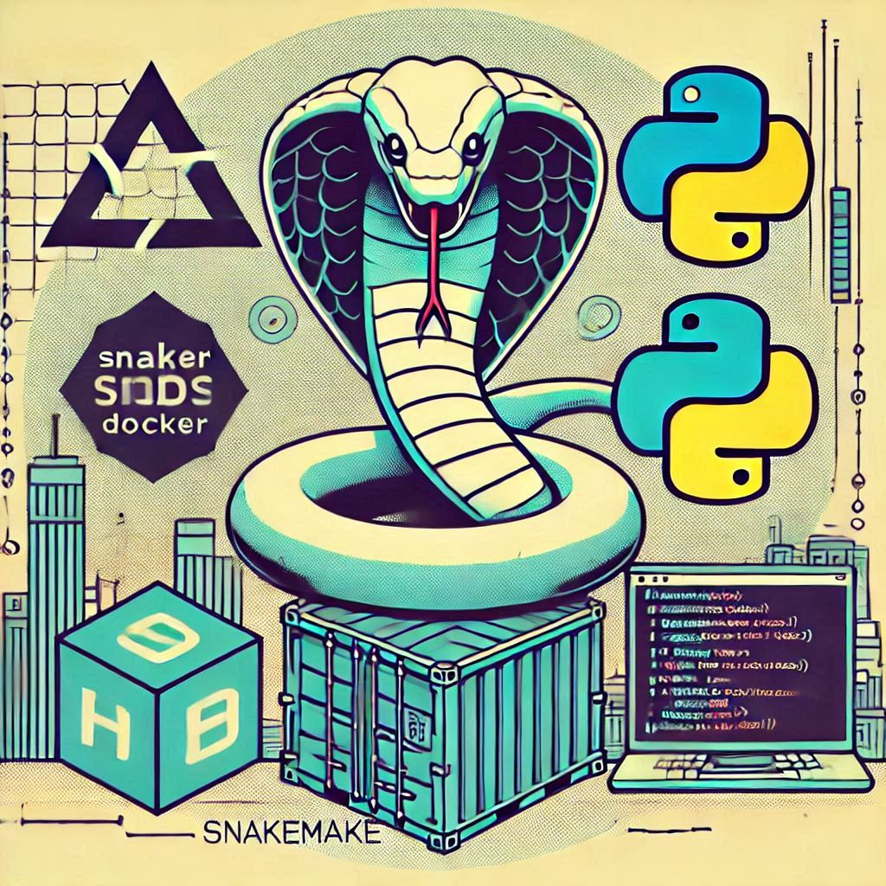

# Annotation challenge [^1]
## Basic bioinformatics pipeline to annotate a VCF v4.1 file with Python3 and BASH (shell scripts) using ANNOVAR with Snakemake

  

### TERMS
bioinformatics
: a scientific field that uses computers, math, statistics, and databases to collect, store, analyze, and share biological information.  
script
: multiple commands ordered in a way to perform a given task efficiently.  
pipeline
: a sequential series of scripts, using several tools and other resources, to perform a given task in an orderly manner.  
VCF
: Variant Calling File, one of the most used formats to show the results of a variant calling pipeline.  
ANNOVAR
: an efficient software tool to utilize update-to-date information to functionally annotate genetic variants detected from diverse genomes.  
snakemake
: a workflow management system tool to create reproducible and scalable data analyses.

### STEPS:
1. After **cloning** this repository, use the Dockerfile (made to address different needs while being light) to **build and run the image**
2. Once inside the **container**, make sure you are in the **CONDA environment** to run Snakemake
3. **Download** other extra required files (dbSNP database) to execute the analyses (since these are large - >10GB - files, they are provided in Docker)
4. Run the **Snakefile** to execute the **pipeline**
5. Run **Flask** to execute the **API**

### Most of the contents in the "annovar" directory comes from the following unzipped web-downloaded file: annovar.latest.tar.gz
tar -xzvf annovar.latest.tar.gz

**PS:** I wanted to use this resource/tool because in my Master's degree the variant calling pipeline I updated uses [ANNOVAR](https://annovar.openbioinformatics.org/en/latest/).  
*Docker:* in the '.dockerignore' file there are a few files (dbSNP and even gnomAD - a database that I thought to use for AF, but it is too big) that were there in the ANNOVAR directory before.

### USAGE (CMDs):
- `git clone git@github.com:FilipeFerreiraSantos/Annotation_challenge.git` (to have locally this public repository)
- `docker build -t fferreira/ubuntu20.04-annovar_snakemake_flask-api:latest .` (to build the image)
- `docker run --network=host -it fferreira/ubuntu20.04-annovar_snakemake_flask-api bash` (to allow internet connection - ANNOVAR DB downloads and Flask API - and run commands inside the container)
- `conda init; conda activate snakemake_env` (if necessary --> in this case, run `source path/to/.bashrc`)
- `bash download_annovar_db.sh` (to download the dbSNP database - and others, if wanted/needed - to run the analyses)
- `snakemake -j 10` (run with the '-n' FLAG for a "dry (test) run"; careful with the '-j' FLAG - adjust it according to your computer power)
- `python flaskApp.py` (to start the Flask API)

### SNAKEMAKE
The "Snakefile" uses a few global information from the "config.yaml" essentially contains 3 rules:
1. 'convert_to_annovar': uses the VCF as input and converts it to an intermediate file in a format compatible with ANNOVAR
2. 'annotate_with_annovar': annotates the variants with meaningful information for the variants such as gene name, function, position, dbSNP, and Allele Frequency
3. 'edit_output': edits the final output to adjusts some details, for instance the last 3 columns coming from the VCF

**PS:** a few files were left for reference, for example the intermediate input file (data), the logs (logs) and the final outputs (results).

### FLASK API
Try to search for specific variants by either position, allele frequency (AF from ABraOM), or even sequencing depth (DP). For instance:  
curl -X GET "http://0.0.0.0:5000/query?Chr=1&Start=877831&End=877831&Ref=T&Alt=C"  
curl -X GET "http://0.0.0.0:5000/query?abraom_freq=0.1"  
curl -X GET "http://0.0.0.0:5000/query?DP=100"  
curl -X GET "http://0.0.0.0:5000/query?Chr=2&Start=877831&End=877831&Ref=T&Alt=C" (to see an error)  
curl -X GET "http://0.0.0.0:5000/query?Chr=1&Start=877831&End=877831&Ref=T" (to see another type of error)

*Instructions.txt*  
This file contains the instructions sent to me by email for your convenience.

## CONTACT
email: fil*************santos93@gmail.com  
phone: +55 (**) 945*****92

[^1]: Due date was: December 09th 2024.
